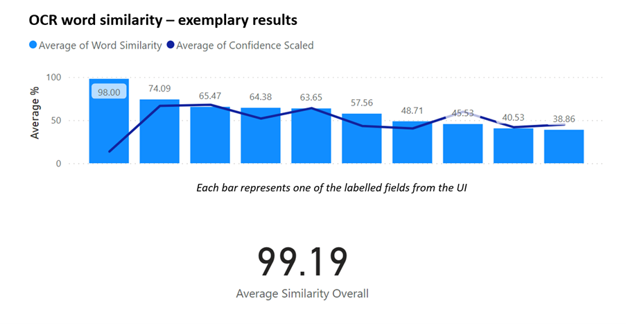

# Benchmarking Forms Recognizer

Developing customized OCR solutions unlocks new possibilities such as the definition of bespoke categories that can be located within a document or, image. A commonly asked question that needs to be addressed is: **“How good does this solution work on my data”?** We present an approach that allows both: to **benchmark Microsoft’s Forms Recognizer leveraging [Forms Recognizer Studio UI](https://formrecognizer.appliedai.azure.com/studio) and well as to train a custom model leveraging the ground truth annotations**.




## Project Structure:

```
.
├── labelling               
│   ├── eval_tables             # outputs of benchmarking with results
│   ├── FR_output               # directory that contains ocr.json files
│   ├── GT_check                # directory that contains labels.json files
│   ├── images                  # directory that contains image files
│   ├── notebooks               # notebooks for debugging and testing
│   ├── utils.py                # script containing helper functions
│   └── ... .py scripts         # scripts to perform benchmarking calculation
└── calculate_ocr_benchmark.sh  # script to execute the OCR calculation
```


## Data Staging

Copy the contents of your labelling and OCR exercise into the following folders:

**Inputs:**

 - **OCR** [GT_check](./labelling/FR_output/) for ocr.json files 
 - **Ground Truth Labels**  [GT_check](./labelling/GT_check/) for labels.json files
 - **Images**  [images](./labelling/images/) for image files (if needed)

 In case you have all input files in one folder (which is the view you will most likely see in [Azure Storage Explorer](https://azure.microsoft.com/en-us/products/storage/storage-explorer)), you can also dump them at root level and leverage [copy_distribute_files.py](./copy_distribute_files.py) to copy them in the directories above.

## Evaluation metric

Word similarity is computed using the [Levenshtein Distance](https://people.cs.pitt.edu/~kirk/cs1501/Pruhs/Spring2006/assignments/editdistance/Levenshtein%20Distance.htm) utilising [fuzzywuzzy's ratio function](https://pub.dev/documentation/fuzzywuzzy/latest/fuzzywuzzy/ratio.html)

## Benchmarking

This section explains how to compute the word similarity on:
 1. OCR level
 2. Field/Entity level

 Between those two methods, there is one significant difference. The OCR task itself, does not require any custom training nor, can it be fine tuned. The field/entity recognition (those that you defined through the [Forms Recognizer Studio UI](https://formrecognizer.appliedai.azure.com/studio)), does require training to make inferences on not only what content the document/image contains but also which pre-defined fields to attribute elements of the document to. For a more detailed explanation, please refer to this [documentation](https://learn.microsoft.com/en-us/azure/applied-ai-services/form-recognizer/how-to-guides/build-a-custom-model?view=form-recog-3.0.0).   

### OCR formatting and word similarity calculation

**Pre-processing:**

 [convert_ocr_output.ipynb](./labelling/notebooks/convert_ocr_output.ipynb) provides the interactive testing for [evaluate_performance_ocr.py](./labelling/format_process_files_labels.py) and [evaluate_performance_labels.py](./labelling/format_process_files_labels.py).To combine the annotated ground truth with the Forms Recognizer output, the *BOUNDING BOX* is used as join key. The Levenshtein distance is then computed on the word/token pairs. We recommend to look into the outputs (see below) to review a side by side comparison of predicted and ground truth values.   

**Output:**

[evaluation_combined](./labelling/eval_tables/evaluation_combined/) with `results_transactions.csv` summarising all the results on a transactional level. 

**Execute:**

After you performed all adjustments in the python scripts, navigate to the root of the project and run: [calculate_ocr_benchmark.sh](./calculate_ocr_benchmark.sh). 

### Field/Entity formatting and word similarity calculation

**Pre-processing:**

The pre-processing steps are combined with the computation of the word similarity metric. The entire pipeline is contained in [evaluate_entities.py](./labelling/evaluate_entities.py). To combine the annotated ground truth with the Forms Recognizer output, the *CATEGORY* (denoted as level in the code) is used as join key. This is due to the fact that bounding boxes do not necessarily overlap when determining the position of the entities that you labelled in the ground truth and what your trained model has predicted. Further, since the predicted and annotated categories do not necessarily have the same count, they are later grouped into sentences per category.   

**Output:**

[entity_evaluation](./labelling/eval_tables/entity_evaluation/) with `results_transaction_entity.csv` summarising all the results on a transactional level. 

**Execute:**

The entire pipeline is contained in [evaluate_entities.py](./labelling/evaluate_entities.py), navigate to the root of the project and run: [calculate_entity_benchmark.sh](./calculate_entity_benchmark.sh). 

## Summary of all steps

Please consult this short summary of all steps to get you started:
1.	Annotate the files 
2.	Download the zip file from the GitHub repository
3.	Download the annotated project from Azure Storage explorer
4.	Place your data at the root level
5.	Distribute the files into `./labelling/FR_output/` , `./labelling/GT_check/` and optionally into `./labelling/images/` if your input are image files
6.	Execute the shell scripts to compute the benchmark OR, use the provided notebooks for interactive benchmarking / debugging.


## Developer Notes 

**The need for bounding box conversion**

This is an important step as the bounding box / polygon formats of the labels.json and ocr.json files come in different scales. As such, we need to scale them to the same scale. In case you use this repository to perform benchmarking against a different OCR solution, chances are that the output comes in a different bounding box taxonomy and some sort of harmonisation needs to be performed.

**Bounding box conversion for different file formats**

Please note that this repository has been tested on .JPEG and .PNG files. In case you have a different input such as .PDF files or others, it is recommended to run the notebooks first for testing and then amend the .py scripts. The parameter that requires change with a change of file format will occur in the `convert_inches_pixel_normalized_vector()` function with the `pixel_conv_x`and `pixel_conv_y` parameters determining the width and height of the image or, document. For images this pixel conversion parameter is automated by leveraging the image size through the contents of `./images/` folder. For PDF files, this parameter might be static and doesn't need any dynamic allocation.

## Visualisation of results

To visualise the outputs from [Benchmarking](##Benchmarking), you can leverage the tool of your choice. This repository provides a basic set of aggregations to get a first glimpse of the results. We do, however, recommend to use visualisation tools like [PowerBI](https://powerbi.microsoft.com/) for advanced filters, visuals and easier replacement of new benchmarking results.

## Contributing

This project welcomes contributions and suggestions.  Most contributions require you to agree to a
Contributor License Agreement (CLA) declaring that you have the right to, and actually do, grant us
the rights to use your contribution. For details, visit https://cla.opensource.microsoft.com.

When you submit a pull request, a CLA bot will automatically determine whether you need to provide
a CLA and decorate the PR appropriately (e.g., status check, comment). Simply follow the instructions
provided by the bot. You will only need to do this once across all repos using our CLA.

This project has adopted the [Microsoft Open Source Code of Conduct](https://opensource.microsoft.com/codeofconduct/).
For more information see the [Code of Conduct FAQ](https://opensource.microsoft.com/codeofconduct/faq/) or
contact [opencode@microsoft.com](mailto:opencode@microsoft.com) with any additional questions or comments.

## Trademarks

This project may contain trademarks or logos for projects, products, or services. Authorized use of Microsoft 
trademarks or logos is subject to and must follow 
[Microsoft's Trademark & Brand Guidelines](https://www.microsoft.com/en-us/legal/intellectualproperty/trademarks/usage/general).
Use of Microsoft trademarks or logos in modified versions of this project must not cause confusion or imply Microsoft sponsorship.
Any use of third-party trademarks or logos are subject to those third-party's policies.
